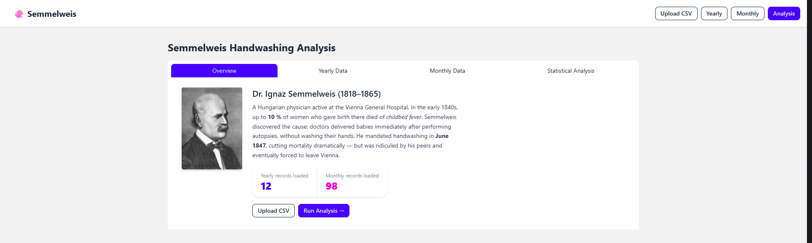
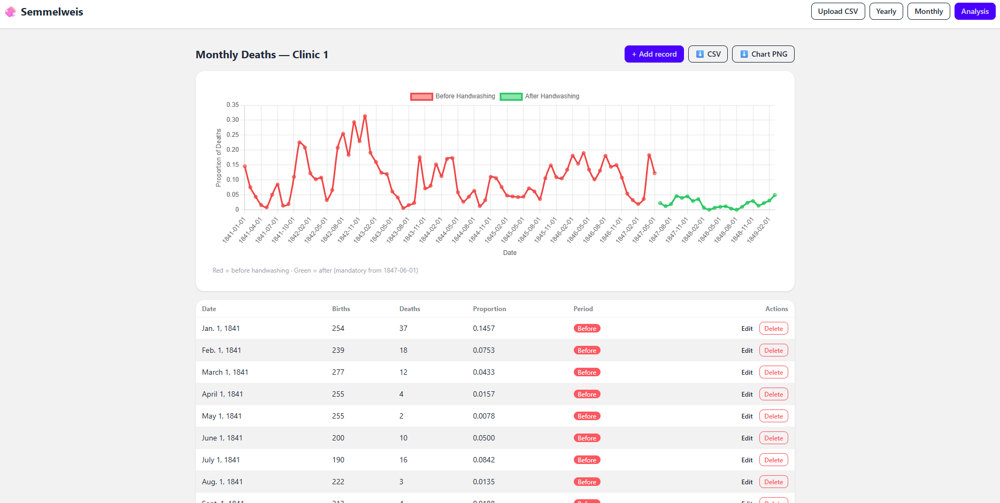

# 🧼 Semmelweis Handwashing Analysis — Django Data Visualization Project

A Django web application that recreates the classic **Ignaz Semmelweis handwashing analysis** using historical maternal mortality datasets.

This project combines:

- Django backend development
- Statistical analysis
- Interactive Chart.js visualizations
- CSV import/export
- Responsive UI with DaisyUI + Tailwind CSS
- Scientific data storytelling

The application demonstrates how mandatory handwashing dramatically reduced deaths from childbed fever at Vienna General Hospital in the 1840s.

---

# 📸 Features

## Dashboard

- Historical overview of Dr. Ignaz Semmelweis
- Interactive tabbed interface
- Dataset statistics
- Chart previews
- Quick navigation

## CSV Import System

Upload:

- `yearly_deaths_by_clinic.csv`
- `monthly_deaths.csv`

Features:

- Validation
- Automatic replacement of old records
- Error handling
- Django form processing

## Yearly Analysis

- Compare Clinic 1 vs Clinic 2
- Interactive dual-line chart
- CRUD operations
- Tabbed data tables
- CSV export
- PNG chart export

## Monthly Analysis

- Before vs after handwashing visualization
- Period badges
- Full CRUD support
- Monthly mortality trend analysis

## Statistical Analysis

Includes:

- Clinic comparison analysis
- Handwashing impact analysis
- Bootstrap confidence intervals
- Welch’s t-test
- Statistical significance detection
- Bootstrap histogram visualization

## Django Admin Panel

Manage all records using Django’s built-in admin interface.

---

# 🧪 Statistical Methods Used

This project reproduces parts of the original Semmelweis notebook analysis using Python and Django.

Implemented statistical concepts:

- Mean mortality comparison
- Bootstrap resampling
- 95% confidence intervals
- Welch’s t-test
- Distribution visualization
- Mortality trend analysis

---

# 🛠 Tech Stack

## Backend

- Python
- Django

## Frontend

- HTML5
- Tailwind CSS
- DaisyUI
- JavaScript

## Data Visualization

- Chart.js

## Database

- SQLite (default Django database)

---

# 📂 Project Structure

```text
semmelweis_project/         ← Django project root (created by startproject)
├── manage.py
├── requirements.txt
├── db.sqlite3              ← auto-created on first migrate
├── semmelweis_project/     ← project package (settings, root urls, wsgi)
│   ├── __init__.py
│   ├── settings.py
│   ├── urls.py
│   └── wsgi.py
├── analysis/               ← the single Django app
│   ├── __init__.py
│   ├── admin.py
│   ├── apps.py
│   ├── forms.py
│   ├── models.py
│   ├── services.py         ← all pandas/matplotlib/scipy logic lives here
│   ├── urls.py
│   ├── views.py
│   └── migrations/
│       ├── __init__.py
│       └── 0001_initial.py
├── templates/              ← project-level templates directory
│   ├── base.html
│   └── analysis/          
│       ├── upload.html
│       ├── yearly_list.html
│       ├── yearly_form.html
│       ├── _yearly_table.html   ← reusable partial (prefixed with _)
│       ├── monthly_list.html
│       ├── monthly_form.html
│       ├── confirm_delete.html
│       └── analysis_results.html
├── static/
│   └── js/
│       └── charts.js       ← Chart.js helper functions
└── media/
    └── uploads/
        └── semmelweis.jpeg ← doctor portrait 

---

# ✨ Key Engineering Features

## Reusable Templates

Uses Django partial templates:

```html

```

---

## DaisyUI Radio-Input Tab Pattern

All tabbed sections follow DaisyUI v4 requirements:

```html
<input type="radio" class="tab" />
<div class="tab-content">...</div>
```

Each `.tab-content` must immediately follow its radio input.

---

## Modular Chart Rendering

Reusable Chart.js helper functions:

- `renderClinicChart()`
- `renderMonthlyChart()`
- `renderBootstrapHistogram()`

---

## Defensive JavaScript

Charts safely guard against missing data:

```javascript
if (!el || !data || data.empty) return;
```

---

# 📊 Application Pages

| URL | Description |
|---|---|
| `/` | Dashboard |
| `/upload/` | Upload CSV datasets |
| `/yearly/` | Yearly clinic comparison |
| `/monthly/` | Monthly mortality analysis |
| `/analysis/` | Full statistical analysis |
| `/admin/` | Django admin panel |

---

# 🚀 Installation

## 1. Clone the Repository

```bash
git clone <your-repository-url>
cd semmelweis-analysis
```

---

## 2. Create Virtual Environment

### Windows

```bash
python -m venv venv
venv\Scripts\activate
```

### macOS/Linux

```bash
python3 -m venv venv
source venv/bin/activate
```

---

## 3. Install Dependencies

```bash
pip install -r requirements.txt
```

---

## 4. Run Migrations

```bash
python manage.py makemigrations
python manage.py migrate
```

---

## 5. Create Superuser (Optional)

```bash
python manage.py createsuperuser
```

---

## 6. Start Development Server

```bash
python manage.py runserver
```

Open:

```text
http://127.0.0.1:8000/
```

---

# 📥 Importing Data

Go to:

```text
/upload/
```

Upload:

- `yearly_deaths_by_clinic.csv`
- `monthly_deaths.csv`

The application automatically imports and processes the datasets.

---

# 📈 Charts Included

## Clinic Comparison Chart

Compares yearly mortality proportions between:

- Clinic 1
- Clinic 2

---

## Monthly Mortality Chart

Shows mortality trends:

- Before handwashing
- After handwashing

---

## Bootstrap Histogram

Visualizes:

- Bootstrap sampling distribution
- 95% confidence interval bounds

---

# 🧠 What This Project Demonstrates

## Django Skills

- Models
- Forms
- CRUD operations
- Generic class-based views
- URL routing
- Template inheritance
- Admin customization
- Static/media handling

## Frontend Skills

- Responsive layouts
- Tailwind CSS
- DaisyUI components
- Chart.js integration
- Interactive tabs

## Data & QA Skills

- Statistical analysis
- Data validation
- CSV processing
- Analytical reasoning
- Visualization logic

---

# 📷 Preview

### Home Page


---


### Dashboard Page


---

### Monthly Death Page 


---

### Statistical Analysis Page


# 📚 Historical Background

Dr. Ignaz Semmelweis discovered that doctors moving directly from autopsies to childbirth without washing their hands caused deadly infections in maternity wards.

After introducing mandatory handwashing in 1847, mortality rates dropped dramatically.

This project visualizes and statistically validates that discovery using historical datasets.
